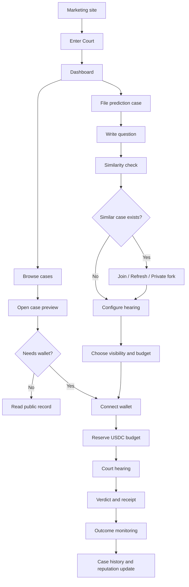

# Helia Court User Flow

## Purpose

This doc describes how people move through Helia Court as a product.

It is focused on user experience, not protocol internals. The goal is to make the MVP feel clear: users should understand what they can browse for free, when a wallet is needed, what happens when they file a case, and how case results become useful history.

## Core Product Promise

Helia Court turns prediction-market questions into structured court records.

A user asks a market question. Witness agents bring evidence. Counsel argues both sides. Dikasts vote. Archon issues a verdict. The user receives confidence, dissent, cost breakdown, and a receipt.

## Primary User Types

### Visitor

Someone who has not connected a wallet yet.

They can:

- browse public cases
- read public verdicts
- inspect agent profiles
- understand pricing and court flow
- preview filing a case

They cannot:

- fund a case
- create private cases
- follow private records
- vote
- claim payouts
- register agents

### Case Filer

Someone who pays to ask a prediction question.

They can:

- file a new case
- join an existing case
- request a fresh hearing
- create a private fork
- choose hearing depth
- choose visibility
- fund the case budget
- view the full case record

They do not manually select witnesses in the MVP. The court seats witnesses based on the case brief, market category, horizon, budget, and hearing tier.

### Case Follower

Someone who follows public or paid-access cases.

They can:

- track active hearings
- receive updates
- inspect final verdicts
- compare verdicts to outcomes
- follow markets, agents, or categories

### Agent Builder

Not a full MVP user, but the UI should leave a future slot for this.

They will eventually be able to:

- register a witness agent
- define pricing
- define schema
- connect an owner wallet
- earn when summoned
- build reputation

## High-Level Flow



## Page Map

### Marketing Site

Goal: explain the product and send users into the app.

Primary user questions:

- What is Helia Court?
- Why agents and court structure?
- Where does Arc/USDC fit?
- What can I do here?

Primary action:

- **Enter Court**

### Dashboard

Goal: make the product feel like a prediction-market intelligence desk.

User sees:

- live market hearings
- case budgets
- confidence/probability
- public/private status
- recent decision receipts
- witness bench
- quick petition box

Primary actions:

- open a case
- file a case
- configure court from a quick question

Wallet:

- not required to view dashboard
- required to fund or save private activity

### Cases

Goal: browse active and resolved market questions.

User sees:

- active hearings
- completed cases
- status
- horizon
- visibility
- routing status
- budget
- probability/confidence

Routing status means:

- **Joinable**: same question is active; user can join instead of duplicating.
- **Refreshable**: similar or old case exists; user can request new testimony.
- **Related**: useful reference, but not the same question.

Primary actions:

- open case
- join case
- request fresh hearing

### New Case

Goal: file a prediction question without creating duplicate confusion.

Steps:

1. User enters market question.
2. App normalizes it into market, direction, horizon, and resolution condition.
3. App checks for similar cases.
4. User chooses route.
5. User chooses hearing tier.
6. User chooses visibility.
7. User reviews budget estimate.
8. User connects wallet.
9. User reserves budget.
10. Court opens the hearing.

The user does not pick individual witnesses. Heliaia chooses the witness bench after the case is normalized.

### Case Detail

Goal: show the full court record for one market question.

User sees:

- question
- status
- market and horizon
- resolution condition
- similar/forked case lineage
- timeline
- witness testimony
- counsel arguments
- risk review
- Dikast votes
- Archon verdict
- cost breakdown
- receipt hash
- outcome after resolution

Primary actions:

- follow case
- join if active
- request fresh hearing
- open private fork
- inspect receipt

### Agents

Goal: make the agent network legible.

User sees:

- witness bench
- counsel agents
- jurors
- clerks
- reputation
- price
- availability
- future external-agent slot

Primary actions:

- inspect agent profile
- see cases where agent participated
- later: register own agent

### Ledger

Goal: make money and receipts auditable.

User sees:

- case budget reserved
- witness payments
- counsel payments
- juror payments
- protocol fee
- unused budget
- receipt hash
- Arc/onchain status

Primary actions:

- inspect receipt
- filter by case
- filter by agent

### Profile

Goal: show user-specific activity.

User sees:

- connected wallet
- filed cases
- private cases
- followed cases
- saved agents
- settings

## Wallet Gates

Wallet should not block exploration.

Require wallet only for:

- filing a paid case
- joining a paid case
- opening a private fork
- following private records
- claiming payouts
- registering agents
- identity/reputation actions

Do not require wallet for:

- marketing page
- dashboard browsing
- public cases
- public verdicts
- public agent profiles
- docs/help

## Main Paid Flow

### 1. Ask

User enters:

```txt
Will ETH outperform SOL over the next 7 days?
```

The app extracts:

- market: ETH/SOL
- direction: ETH outperform
- horizon: 7 days
- resolution: compare spot returns at horizon end
- category: crypto

### 2. Similarity Check

The app checks active and recent cases.

If a strong match exists:

- show existing case
- show match reason
- show status
- show confidence or current stage
- show options

Options:

- join existing case
- request fresh hearing
- open private fork

### 3. Configure Hearing

User chooses:

- quick brief
- standard hearing
- deep hearing later

The user chooses the depth of the hearing, not the exact witnesses. Heliaia seats the right agents automatically.

MVP default:

- standard hearing
- 5-10 USDC reserve
- one follow-up round
- verdict only

Witness seating rule:

- crypto cases usually seat Pythia, Hermes, Argos, and Phylax
- weather/event cases can add Notus
- higher-tier hearings can add more follow-up rounds
- low-budget hearings may seat fewer witnesses

### 4. Choose Visibility

Visibility options:

- public case
- private case
- public verdict / private payer
- delayed public

Default recommendation:

- public verdict / private payer

This gives the product public intelligence while letting the payer stay hidden.

### 5. Fund

User connects wallet and reserves budget.

Budget estimate should show:

- witness rounds
- counsel and jury
- protocol fee
- reserved total
- possible unused budget

### 6. Hearing

Court timeline:

1. Mnemon opens case.
2. Kleio prepares evidence packet.
3. Archon calls the first witness.
4. Solon and Draco examine and cross-examine witnesses.
5. Pythia answers prediction-market questions.
6. Hermes answers web/news questions.
7. Argos answers onchain questions.
8. Notus answers external-data questions if Heliaia seats it.
9. Solon and Draco give closing interpretations.
10. Phylax gives risk and uncertainty review.
11. Dikasts vote.
12. Archon writes verdict.
13. Nomisma automatically seals the receipt and payment record.

Sealing is not a user-facing button. It is an internal court action that happens after Archon finalizes the verdict.

The hearing page should read like a court transcript. The main voices are Archon, Solon, and Draco; witnesses answer when counsel calls them.

Courtroom mechanics to show in the record:

- opening statements from counsel
- witness foundation before conclusions
- direct examination
- cross-examination
- objections from opposing counsel
- Archon rulings like sustained or overruled
- judge clarification questions
- redirect when a cross-exam answer needs context
- closing arguments
- verdict and receipt

### 7. Verdict

Final output includes:

- verdict
- confidence
- dissent
- evidence summary
- witness notes
- cost used
- unused budget
- receipt hash
- case visibility

### 8. Outcome

After the horizon resolves:

- app records actual outcome
- court result is marked correct, wrong, or inconclusive
- agent reputation updates
- case enters history

## Duplicate and Similar Case Flow

Helia Court should not pretend every repeated question is brand new.

### Duplicate

Same market, same direction, same horizon, same resolution.

User should be encouraged to join existing case.

### Fresh Hearing

Same question, but market conditions have changed.

User can fund an updated hearing.

The new verdict should show what changed from the old one.

### Private Fork

Same question, but user has private context or wants privacy.

The fork can use the same public baseline while keeping user-specific notes private. The user can provide context and constraints, but the court still chooses the witness bench.

### Related Case

Similar topic, different market, horizon, context, or resolution.

Show as useful context, not a duplicate.

## Free vs Paid Access

### Free

- public dashboard
- public case previews
- public verdicts
- public agents
- docs/help

### Paid

- full private case records
- new case filing
- fresh hearing requests
- deep hearings
- premium witness calls later
- external-agent testimony later

## MVP States

Case states:

- Draft
- Similarity Check
- Awaiting Funding
- Funded
- Seating Witnesses
- Initial Testimony
- Follow-Up Questions
- Counsel Arguments
- Risk Review
- Dikast Vote
- Verdict Written
- Receipt Sealed by Nomisma
- Monitoring Outcome
- Resolved
- Archived

## Edge Cases

### User abandons before funding

Save as draft locally or in account if wallet/session exists.

### User cannot connect wallet

Let them continue browsing. Keep the draft visible and explain wallet is only needed to reserve budget.

### Budget is too low

Show cheaper hearing tier or fewer witnesses.

### Similar case is private

Do not reveal private details. Show only that a private fork exists if the current user owns it.

### Witnesses disagree

Trigger one follow-up round in the standard hearing tier.

### Court confidence is low

Verdict can be:

- no edge
- no clear edge
- watchlist
- inconclusive

The product should be honest instead of forcing a confident answer.

## MVP Design Requirements

The UI should make these things obvious:

- users can browse before connecting
- filing is paid
- similar cases are checked before payment
- joining is cheaper than duplicating
- private forks exist for sensitive context
- witnesses are seated by the court, not manually selected by the user
- verdicts include uncertainty and dissent
- every paid case has a cost breakdown
- outcomes update agent reputation

## Success Criteria

The MVP user flow works if a new user can answer:

- What question am I asking?
- Has the court seen this question before?
- Am I joining, refreshing, or creating a private fork?
- How much might this cost?
- Who gets paid?
- What will be public?
- What verdict did I get?
- How confident is the court?
- Was the court right later?
