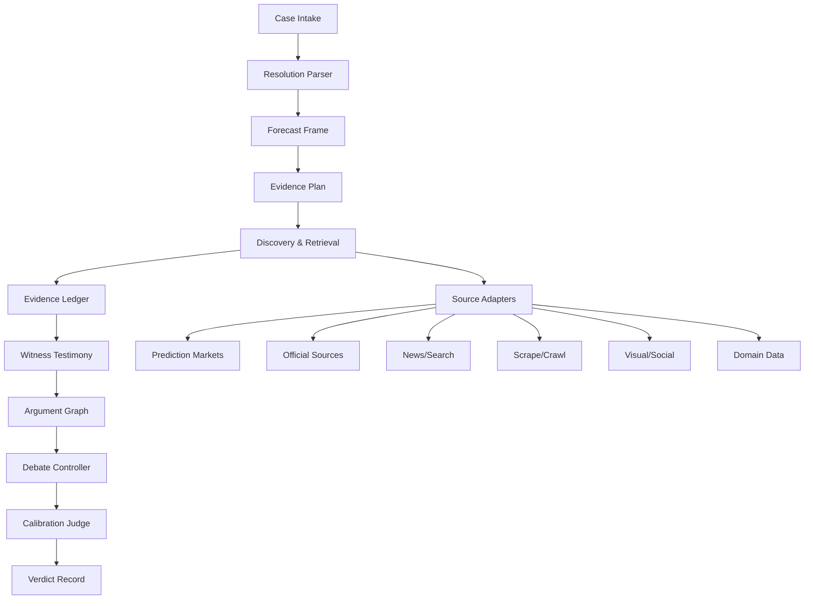

# Helia Court Engine Architecture

Helia Court should be a forecasting engine with courtroom UX, not a courtroom script with tools attached.

The current implementation has the right ingredients, but too many responsibilities are fused together:

- `group-chat.ts` builds the schedule, witness flow, issue list, and agent requests.
- `run-agent.ts` builds context, calls the model, scores evidence, and guards the record.
- Witness tools fetch data, summarize data, and sometimes act like source discovery.
- Prompts carry too much architecture as prose.

That makes the court verbose, repetitive, and brittle. A better engine has clear layers.

## Target Model



## Core Principle

Every market hearing should answer:

1. What exactly resolves Yes or No?
2. What is the current clock and deadline?
3. What direct evidence exists now?
4. What catalysts make Yes plausible?
5. What blockers make No plausible?
6. What base rates or reference classes matter?
7. What does the market believe, and how liquid/reliable is that signal?
8. What probability range is justified after weighing all of that?

The court format should serve those questions, not replace them.

## Proposed Components

### 1. Case Intake

Input:

- question
- resolution context
- market URL(s)
- deadline
- source rules
- optional user links

Output:

```ts
type CaseFrame = {
  question: string
  resolutionCriteria: string[]
  yesCondition: string
  noCondition: string
  deadline?: string
  primarySources: string[]
  backupSources: string[]
  marketUrls: string[]
  forecastMode: 'future' | 'near-deadline' | 'past-resolution' | 'ambiguous'
}
```

The parser should use AI, then a deterministic guard validates dates, URLs, and missing fields.

### 2. Forecast Frame

This is the first real reasoning layer. It should produce a compact memo before any debate:

```ts
type ForecastFrame = {
  timeRemaining: string
  marketGenre: string[]
  requiredEvidence: string[]
  yesPathways: string[]
  noBlockers: string[]
  likelyBaseRates: string[]
  updateTriggers: string[]
  uncertaintyQuestions: string[]
}
```

Example for Ebola:

- Yes pathway: active outbreak, exposed Americans, evacuation, travel/incubation window.
- No blocker: CDC screening/restrictions, no domestic confirmed case yet, short window.
- Quant question: what probability range fits active outbreak plus US importation controls?

### 3. Evidence Plan

This replaces rigid witness selection. It should decide what to fetch, not who talks.

```ts
type EvidenceNeed = {
  id: string
  question: string
  reason: string
  priority: 'must-have' | 'useful' | 'nice-to-have'
  capabilities: Array<
    | 'prediction_market'
    | 'official_source'
    | 'news_search'
    | 'web_scrape'
    | 'visual_read'
    | 'social_count'
    | 'market_data'
    | 'domain_dataset'
  >
}
```

The court then maps evidence needs to tools. Witnesses should not be selected before the court knows what uncertainty it is reducing.

### 4. Discovery & Retrieval

Retrieval should be multi-step:

1. Direct URLs from user and market context.
2. Search query expansion.
3. Official source discovery.
4. Market page discovery.
5. Scrape/crawl pages.
6. Screenshot/visual read if scrape fails or page is visual-heavy.
7. Source dedupe and freshness scoring.

Tool output should never be dumped into the transcript. It should go into the Evidence Ledger.

### 5. Evidence Ledger

The ledger is the source of truth. Agents argue from this, not raw tool results.

```ts
type EvidenceItem = {
  id: string
  sourceTitle: string
  sourceUrl?: string
  sourceType: 'official' | 'market' | 'news' | 'scrape' | 'visual' | 'social' | 'dataset'
  observedAt: string
  claim: string
  supports: 'yes' | 'no' | 'neutral' | 'context'
  directness: 'direct' | 'indirect' | 'background'
  freshness: 'fresh' | 'recent' | 'stale' | 'unknown'
  reliability: 'high' | 'medium' | 'low'
  limitations: string[]
}
```

This prevents repeated witness paragraphs and lets counsel cite compact evidence ids.

### 6. Witness Testimony

Witnesses should not discover the whole internet every time. They should interpret assigned ledger evidence:

- Pythia: market odds, liquidity, changes, market-quality caveats.
- Hermes: fresh news flow and source velocity.
- Aletheia: exact page/source extraction.
- Eikon: visual/screenshot/page-state reading.
- Chronos: timeline, deadline, lag, incubation, event windows.
- Skepsis: source authority and directness.
- Sophia: synthesis of broad evidence.
- Numeros: probability ranges, reference classes, quantitative constraints.
- Domain witnesses: only where the market genre needs structured data.

Witness output should be short:

```ts
type Testimony = {
  witnessId: string
  evidenceIds: string[]
  finding: string
  yesWeight: number
  noWeight: number
  uncertainty: string
  nextQuestion?: string
}
```

### 7. Argument Graph

Instead of long prose loops, the engine should maintain an argument graph:

```ts
type ArgumentNode = {
  id: string
  side: 'yes' | 'no'
  claim: string
  evidenceIds: string[]
  warrant: string
  attacks: string[]
  confidence: number
}
```

Solon and Draco should build and attack nodes:

- Solon adds Yes pathways and attacks No blockers.
- Draco adds No blockers and attacks Yes pathways.
- Archon asks about weak warrants.

This gives the debate memory and stops repeated “moderate weight” filler.

### 8. Debate Controller

The controller should run fewer, smarter phases:

1. Case frame.
2. Evidence plan.
3. Evidence retrieval.
4. Witness mini-panels.
5. Argument construction.
6. Cross-exam of strongest opposing nodes.
7. Calibration.
8. Verdict.

The judge should not call every witness on every issue. It should call the next speaker because a specific uncertainty remains.

### 9. Calibration Judge

Before verdict, the court should run one explicit calibration pass:

```ts
type CalibrationMemo = {
  marketOdds?: string
  baseRate?: string
  yesScenario: string
  noScenario: string
  probabilityRange: [number, number]
  confidence: number
  keySensitivity: string
}
```

This is where questions like Ebola should stop being “no confirmed case yet” and become:

- Market says about 20-25% Yes.
- Official current-risk language supports No as favored.
- Known exposed Americans and incubation window keep a non-trivial Yes tail.
- Verdict: leaning No, but probability range maybe low double digits to market-adjacent depending on source strength.

The exact range comes from the record, not a hardcoded template.

## New Folder Shape

```text
backend/src/court-engine/
  case-frame/
    parse-case.ts
    court-clock.ts
  planning/
    build-forecast-frame.ts
    build-evidence-plan.ts
  retrieval/
    run-evidence-plan.ts
    source-dedupe.ts
    adapters/
  ledger/
    evidence-ledger.ts
    evidence-scoring.ts
  testimony/
    run-witness-panel.ts
    witness-profiles.ts
  arguments/
    argument-graph.ts
    run-counsel.ts
  controller/
    hearing-controller.ts
    next-move.ts
  calibration/
    calibrate-verdict.ts
  transcript/
    render-transcript.ts
```

The existing `backend/src/court` can stay temporarily as the compatibility shell while this new engine is introduced.

## Migration Plan

### Phase 1: Build The Ledger

- Add `EvidenceItem` and `EvidenceLedger`.
- Convert current `ToolEvidence` into normalized ledger items.
- Let transcript turns cite evidence ids.
- Keep current hearing flow.

### Phase 2: Replace Witness Selection With Evidence Planning

- Add `CaseFrame` and `ForecastFrame`.
- Add AI evidence planner with deterministic guards.
- Tools run from evidence needs, not from witness identity.

### Phase 3: Add Argument Graph

- Counsel outputs argument nodes instead of only prose.
- Archon attacks weak warrants.
- Transcript renders human prose from graph updates.

### Phase 4: Add Calibration Pass

- Numeros/Archon produce a probability range from ledger + argument graph.
- Verdict must include scenario branches and sensitivity.

### Phase 5: Slim The Courtroom

- Replace long fixed witness loops with adaptive panels.
- Keep the courtroom feel, but make every turn reduce uncertainty.

## What This Fixes

- No more false "no market exists" when search API misses but page/search evidence exists.
- No more witness walls of repeated text.
- No more treating future markets as confirmation checks.
- No more judge as a turn announcer.
- Better quantitative reasoning.
- Better source freshness and directness.
- Better debate memory.

The result should feel less like a staged transcript and more like an analyst team arguing in court form.
